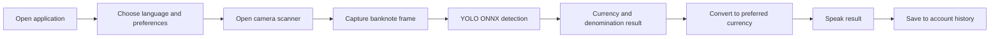

# DhanDrishti / Currency Vision

## Project Presentation Pitch

### One-line pitch

DhanDrishti is an accessibility-first currency assistant that uses computer vision, voice interaction, and currency conversion to help people identify banknotes independently and confidently.

## The Problem

Identifying an unfamiliar banknote is difficult for people with visual impairments and inconvenient for anyone handling multiple currencies. Existing solutions often split the task across separate tools:

- One tool identifies a note.
- Another performs currency conversion.
- A third provides voice assistance.
- Previous results are difficult to review or are not stored securely.

This creates friction at the exact moment the user needs a fast, clear, and trustworthy answer.

## Our Solution

DhanDrishti brings the complete workflow into one application. A user points a phone camera at a banknote, and the system:

1. Captures the banknote image.
2. Detects its currency and denomination using a trained YOLO ONNX model.
3. Reports the confidence of the result.
4. Converts the value into the user’s preferred currency.
5. Announces the result through localized voice output.
6. Saves the detection to the user’s personal history.

The interface is designed around large controls, simple navigation, language preferences, voice feedback, and reduced visual complexity.

## Target Users

- People with visual impairments who need independent banknote recognition.
- Travelers handling unfamiliar currencies.
- Retail and cash-handling users who need a quick denomination check.
- Students and researchers exploring practical computer vision applications.

## What Makes It Different

### Accessibility is the starting point

Voice feedback, browser speech recognition, large interaction targets, language support, and a straightforward scanning flow are core product decisions rather than optional add-ons.

### Recognition and conversion are connected

The user does not need to copy the detected amount into a separate calculator. Detection and conversion happen in the same result flow.

### It supports a complete user journey

The application includes onboarding, preferences, authentication, scanning, results, conversion, voice settings, history, profile management, and counterfeit-checking views.

### It is designed for local and service-assisted operation

The ONNX model can run in the browser for the standalone demo. The full application can use a Node/Express API for server-side inference, MongoDB persistence, and secure voice-provider access.

## Supported Recognition Scope

The current model contains 36 banknote classes across six currencies:

- USD
- PHP
- INR
- EUR
- AUD
- CAD

Supported denominations are defined in `Currency_Vision/dataset.yaml` and must remain aligned with the class map in `Currency_Vision/src/banknotes.ts`.

## Model Training and Dataset

### Training data

The detector was trained as a custom object-detection problem using a YOLO-format dataset. The dataset configuration in `Currency_Vision/dataset.yaml` defines:

- Dataset root: `./data`
- Training images: `images/train`
- Validation images: `images/val`
- Number of classes: `36`
- One class label per currency and denomination

The class inventory is:

| Currency | Denominations represented in the dataset |
|---|---|
| USD | 1, 5, 10, 20, 50, 100 |
| PHP | 20, 50, 100, 200, 500, 1000, and 1000 PHP (new) |
| INR | 10, 20, 50, 100, 200, 500, 2000 |
| EUR | 5, 10, 20, 50, 100, 200 |
| AUD | 5, 10, 20, 50, 100 |
| CAD | 5, 10, 20, 50, 100 |

The separate `1000 PHP` and `1000 PHP (new)` labels preserve the visual distinction present in the training classes. The model class order is part of the trained model contract; changing it in `dataset.yaml` or `src/banknotes.ts` without retraining can produce incorrect predictions.

### Training experiments

The notebook `Currency_Vision/All_Model_Training_Code (1).ipynb` records multiple model-training approaches on the same CurrencyVision dataset:

1. **YOLOv8m from Ultralytics Hub** for a medium-sized baseline.
2. **YOLOv8s from Ultralytics Hub** for a smaller and faster baseline.
3. **Custom YOLOv8s** with Coordinate Attention and Adaptive Spatial Pyramid Pooling Fast (AdaptiveSPPF).
4. **RT-DETR** as a transformer-based object-detection comparison.
5. **YOLOv8s-SE**, the custom configuration included in `Currency_Vision/Yolov8s-SE.yaml`, with a Squeeze-and-Excitation block added after SPPF.

This comparison reflects the project goal of balancing recognition quality with an inference model small enough for practical browser or API deployment.

### Main training configuration

The custom YOLO training scripts use these documented defaults:

| Setting | Value | Purpose |
|---|---:|---|
| Input size | 640 x 640 | Standardized model input and runtime preprocessing size |
| Epochs | 50 | Training duration used by the notebook scripts |
| Batch size | 8 | Default for YOLOv8s, custom YOLOv8s, and YOLOv8s-SE |
| Device | CUDA when available, otherwise CPU for YOLOv8s-SE | Hardware-aware training execution |
| Data loader workers | 4 | Parallel data loading in custom YOLO training |
| Optimizer | SGD | Optimization strategy used by the custom YOLOv8s path |
| Initial learning rate | 0.01 | Starting learning rate for the custom YOLOv8s path |
| Final learning-rate fraction | 0.02 | Learning-rate decay target for the custom YOLOv8s path |
| Frozen backbone layers | 5 | Transfer-learning option in the Hub/custom YOLO paths |
| Mosaic probability | 1.0 | Strong composition augmentation in the custom YOLO path |
| MixUp probability | 0.5 | Image-combination augmentation in the custom YOLO path |

The RT-DETR experiment uses a batch size of 16 by default, while the YOLOv8m and YOLOv8s Hub scripts expose the same core parameters through command-line arguments. These values describe the training scripts; they should not be presented as measured performance results.

### Custom architecture contribution

The custom YOLOv8s experiments extend the standard detector in two ways:

- **Coordinate Attention (CoordAtt):** injects positional attention into C2f blocks so the network can preserve useful spatial information about banknote features.
- **AdaptiveSPPF:** replaces the standard SPPF block with multi-scale max-pooling using pooling sizes 5, 9, and 13 while copying compatible pretrained weights.
- **Squeeze-and-Excitation (YOLOv8s-SE):** adds channel-attention recalibration after the SPPF stage in the supplied `Yolov8s-SE.yaml` configuration.

These modifications are intended to help the detector distinguish visually similar denominations and currency designs while keeping the YOLOv8s footprint practical for deployment.

### Training-to-deployment path

```text
YOLO-format labeled images
        |
        v
dataset.yaml: train/validation paths and 36 class names
        |
        v
YOLOv8 / custom YOLOv8 / RT-DETR training experiments
        |
        v
Trained weights and validation outputs
        |
        v
ONNX export: public/model.onnx
        |
        +--> ONNX Runtime WebAssembly in the standalone demo
        +--> ONNX Runtime Node in the Express inference API
```

### Evaluation and limitations

The repository includes the training scripts and the deployed ONNX artifact, but it does not include a verified final precision, recall, mAP, confusion matrix, or per-class validation report. Those metrics should be generated from a fixed held-out test set before making accuracy claims in a formal presentation.

The dataset configuration also describes the folder layout and labels, not the number of images per class. Future training reports should include image counts, class balance, train/validation leakage checks, lighting and viewpoint coverage, and performance on folded, partially occluded, or damaged notes.

## User Experience Flow



## Technology

### Frontend

- React 19
- TypeScript
- Vite
- React Router
- Tailwind CSS
- Lucide icons
- Browser camera and speech-recognition APIs

### Computer vision

- YOLO-based currency detection
- ONNX model execution
- ONNX Runtime WebAssembly for the standalone browser demo
- ONNX Runtime Node for the Express inference API
- Sharp for image resizing and RGB preprocessing

### Backend and data

- Node.js and Express
- MongoDB for users and account-specific history
- Node.js `scrypt` password hashing
- ElevenLabs proxy for optional text-to-speech and transcription
- Exchange-rate service for conversion

## System Flow

```text
Camera or uploaded image
        |
        v
React scanner or browser demo
        |
        v
Image preprocessing: resize, RGB conversion, normalization
        |
        v
YOLO ONNX model
        |
        v
Currency, denomination, confidence
        |
        +--> Conversion result
        +--> Localized voice announcement
        +--> Account history
        +--> Counterfeit/security workflow
```

## Demonstration Script

### Opening

“Imagine receiving a banknote that you cannot identify by sight. You need to know its value immediately, and you do not want to depend on another person or switch between several applications.”

### Problem

“Currency recognition, conversion, and voice assistance are usually disconnected. That makes a simple cash interaction slower and less independent.”

### Product demonstration

“With DhanDrishti, the user opens the scanner and points the camera at a banknote. The system detects the currency and denomination, displays the confidence, converts the amount to the preferred currency, speaks the result in the selected language, and stores the activity in personal history.”

### Technology explanation

“The recognition engine uses a trained YOLO model exported to ONNX. The application can run inference in the browser or through a Node API. This gives us a practical balance between local processing, deployment flexibility, and integration with account history and voice services.”

### Closing

“DhanDrishti is more than a detector. It is a single, accessible workflow that helps users recognize, understand, and manage currency independently.”

## Product Value

### For users

- Faster banknote identification.
- More independence during everyday transactions.
- Spoken results for users who do not rely on visual interfaces.
- Immediate conversion into a familiar currency.
- Personal history for reviewing previous detections.

### For institutions and partners

- A clear applied-AI accessibility use case.
- Modular architecture that can support additional currencies and models.
- A browser-friendly ONNX deployment path.
- A backend integration path for persistence and managed services.

### For the project team

- Demonstrates model training and model deployment.
- Combines computer vision, frontend engineering, backend APIs, databases, and voice technology.
- Provides measurable areas for future evaluation: accuracy, latency, accessibility, and language coverage.

## Current Capabilities

- 36-class banknote recognition.
- Six supported currencies.
- Image upload and camera scanning paths.
- Single, multiple, and automatic detection modes.
- Confidence filtering and low-confidence guidance.
- Currency conversion.
- User signup and login.
- MongoDB-backed profile and detection history.
- Localized interface and result messaging.
- Optional ElevenLabs voice synthesis and transcription.
- Counterfeit/security-check application views.

## Roadmap

### Near term

- Expand and rebalance the training dataset across lighting, angles, folds, and note conditions.
- Add a formal evaluation report with precision, recall, confusion matrix, and latency measurements.
- Improve camera framing guidance and continuous scanning feedback.
- Add automated integration tests for the inference and history APIs.

### Medium term

- Add more currencies and denominations.
- Improve counterfeit detection with validated security-feature data.
- Add stronger server-side sessions and signed authentication tokens.
- Provide offline conversion-rate snapshots with visible freshness indicators.
- Package the experience for mobile deployment.

### Long term

- Personalize voice and interaction settings for individual accessibility needs.
- Add robust offline inference and offline voice prompts.
- Partner with accessibility organizations for usability testing.
- Evaluate the system with real users across different devices and environments.

## Responsible Use

The application should support, not replace, human judgment in high-risk financial situations. Camera quality, lighting, note condition, occlusion, and model coverage can affect recognition. Production deployment should include broader validation, explicit uncertainty messaging, strong authentication, encrypted transport, and privacy review for stored history and voice data.

## Closing Statement

DhanDrishti combines computer vision and accessible interaction design to solve a practical problem: recognizing and understanding currency without unnecessary dependence on others. Its modular architecture makes the project ready for continued model improvement, wider currency coverage, and real-world accessibility evaluation.

## 30-Second Version

“DhanDrishti is an accessibility-first currency assistant for people who need a faster and more independent way to identify banknotes. Using a camera and a trained YOLO ONNX model, it recognizes currency and denomination, reports confidence, converts the value into a preferred currency, speaks the result in the user’s language, and stores the detection history. It combines computer vision, React, Node, MongoDB, and voice technology in one practical workflow.”
